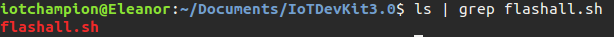
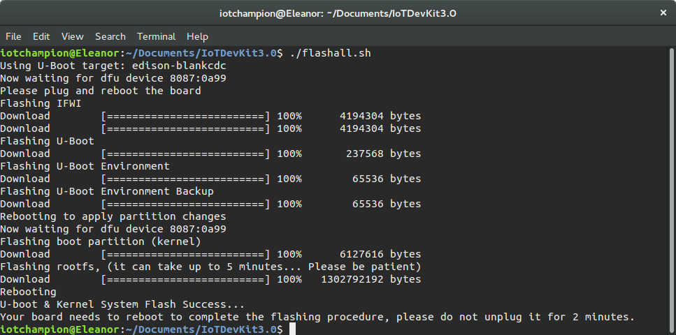

# Pre-Work

> Knowledge of the Linux terminal is mandatory. Ubuntu Linux 15.04 is used, and all command line instructions are done in the default terminal of Ubuntu.

## IoT DevKit 3.0

> For this tutorial we are going to use the Intel® IoT Developer Kit v3.0 release dated in 20160315. \[You can click here to download the image,\]\([https://downloadmirror.intel.com/25871/eng/iot-devkit-prof-dev-image-edison-20160315.zi](https://downloadmirror.intel.com/25871/eng/iot-devkit-prof-dev-image-edison-20160315.zi) or copy and paste the following link [https://downloadmirror.intel.com/25871/eng/iot-devkit-prof-dev-image-edison-20160315.zip](https://downloadmirror.intel.com/25871/eng/iot-devkit-prof-dev-image-edison-20160315.zip) , this version is used because the OS images and repositories are updated to include several popular and useful packages for development, such as Git, Vim, Nano, IoTivity, pip, and many more. For the release notes access the following page: [https://software.intel.com/en-us/blogs/2016/03/30/intel-iot-developer-kit-30-release-notes](https://software.intel.com/en-us/blogs/2016/03/30/intel-iot-developer-kit-30-release-notes)
>
> Unzip the zipped file just downloaded and access the folder. In a terminal make sure there is the flashall.sh script file, type 
>
> `ls | grep flashall.sh`
>
>  and you should see the name flashall.sh as a result. 
>
> 
>
>  Plugin the Intel Edison board to the computer and make sure both USB cables are pluged in. Run the script typing 
>
> `./flashall.sh`
>
> , follow on-screen instructions and verify the following output is the same as the one below. 
>
> 
>
>  Type 
>
> `sudo screen /dev/ttyUSB0 115200`
>
>  to enter the Edison through the terminal, if screen is not installed install it with 
>
> `sudo apt-get install screen`
>
> . At this moment, the Edison will ask for the edison login, type 
>
> `root`
>
>  and now we are in our Edison. If this is not the case, verify you followed all the steps above correctly and typed 
>
> `root`
>
>  right.

